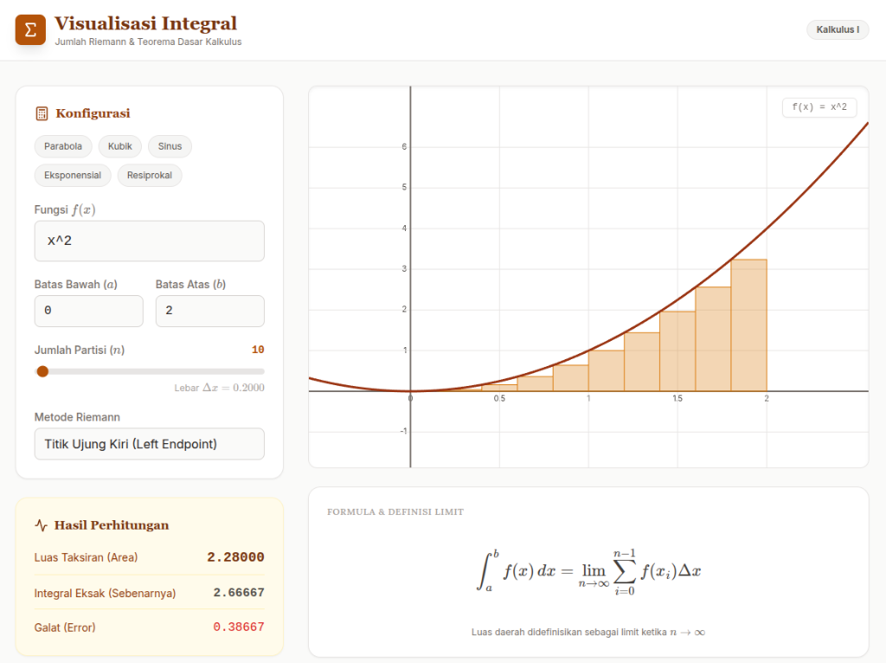

# Visualisasi Integral & Jumlah Riemann



Aplikasi web interaktif untuk memvisualisasikan dan memahami konsep **Jumlah Riemann** dan **Teorema Dasar Kalkulus**. 

Aplikasi ini dirancang untuk mahasiswa, pelajar, dan pengajar Kalkulus I untuk melihat secara langsung bagaimana pendekatan luas daerah di bawah kurva dihitung menggunakan metode partisipasi (persegi panjang) dan bagaimana aproksimasi tersebut mendekati nilai integral eksak seiring bertambahnya jumlah partisi.

## 🌟 Fitur Utama

*   **Visualisasi Grafik Dinamis**: Plotting fungsi matematika secara real-time.
*   **Beragam Metode Riemann**: Mendukung 5 metode pendekatan numerik:
    *   **Titik Ujung Kiri (Left Endpoint)**
    *   **Titik Ujung Kanan (Right Endpoint)**
    *   **Titik Tengah (Midpoint Rule)**
    *   **Aturan Trapesium (Trapezoidal Rule)**
    *   **Aturan Simpson (Simpson's Rule)**
*   **Interaktivitas Penuh**:
    *   Input fungsi matematika bebas (contoh: `x^2`, `sin(x)`, `e^x`).
    *   Atur Batas Bawah ($a$) dan Batas Atas ($b$).
    *   Slider jumlah partisi ($n$) dari 1 hingga 1000 untuk melihat konvergensi.
*   **Analisis Galat (Error)**: Menampilkan perbandingan langsung antara Luas Taksiran (Approximation) dan Integral Eksak (Exact).
*   **Langkah Demi Langkah (Step-by-Step)**: Penjelasan detil bagaimana perhitungan dilakukan untuk setiap langkahnya.
*   **Teori Terintegrasi**: Penjelasan ringkas mengenai Teorema Dasar Kalkulus.

## 🛠️ Teknologi yang Digunakan

*   **[React](https://react.dev/)** - Library UI utama.
*   **[Vite](https://vitejs.dev/)** - Build tool yang cepat.
*   **[Math.js](https://mathjs.org/)** - Parsing dan evaluasi ekspresi matematika.
*   **[Tailwind CSS](https://tailwindcss.com/)** - Utility-first CSS framework untuk styling modern.
*   **HTML Canvas** - Rendering grafik performa tinggi.
*   **MathJax** - Rendering notasi matematika LaTeX yang indah.

## 🚀 Cara Menjalankan (Local Development)

Ikuti langkah-langkah berikut untuk menjalankan proyek ini di komputer lokal Anda:

1.  **Clone Repository**
    ```bash
    git clone https://github.com/ilhambintang17/integral_visual.git
    cd integral_visual
    ```

2.  **Install Dependencies**
    Pastikan Anda sudah menginstall Node.js.
    ```bash
    npm install
    ```

3.  **Jalankan Aplikasi**
    ```bash
    npm run dev
    ```

4.  **Buka di Browser**
    Akses alamat yang muncul di terminal (biasanya `http://localhost:5173`).

## 📚 Rumus Dasar

Aplikasi ini memvisualisasikan definisi integral tentu sebagai limit dari Jumlah Riemann:

$$ \int_{a}^{b} f(x) \, dx = \lim_{n \to \infty} \sum_{i=1}^{n} f(x_i^*) \Delta x $$

Dimana $\Delta x = \frac{b-a}{n}$

## 🤝 Kontribusi

Kontribusi selalu diterima! Silakan buka *issue* atau kirimkan *pull request* jika Anda ingin meningkatkan aplikasi ini.

---
Dibuat dengan ❤️ untuk pembelajaran Kalkulus.
